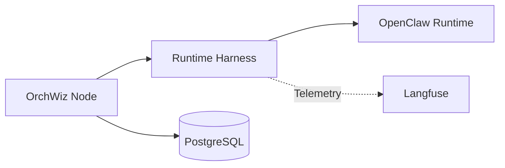

# Orchwiz Architecture

## System Overview

Orchwiz follows a distributed node architecture where each node is a self-contained deployment of the Next.js application with its own database.

## Components

### Frontend (Next.js)
- React-based UI using App Router
- Tailwind CSS for styling
- Server-Sent Events for real-time updates
- Client-side state management

### Backend (Next.js API Routes)
- RESTful API endpoints
- Authentication via Better Auth
- Database access via Prisma ORM
- GitHub integration for PR tracking

### Agent Runtime (OpenClaw)
- Pluggable execution layer for agent sessions and tool calls
- Isolated from UI and storage concerns to allow runtime swaps

### Observability (Langfuse)
- Tracing and observability backend for runtime telemetry
- Captures inputs/outputs, tool usage, latency, and cost signals

### Database (PostgreSQL)
- User management
- Session tracking
- Command execution logs
- Documentation versioning
- Task and verification tracking

### Authentication
- Better Auth with GitHub OAuth
- Session management
- User permissions

## Data Flow

1. **User Interaction** → Next.js Frontend
2. **API Request** → Next.js API Routes
3. **Authentication** → Better Auth
4. **Data Access** → Prisma ORM → PostgreSQL
5. **Response** → Frontend Update

## Node-to-Node Communication

When nodes forward data:
1. Source node collects relevant data
2. Data is formatted and sent via HTTP/WebSocket
3. Target node receives and aggregates data
4. Aggregate visualization is updated

## Runtime & Observability Flow

## Related Notes

- [[Node-Concept]] - Node architecture details
- [[API-Documentation]] - API endpoint reference
- [[Database-Schema]] - Database structure
