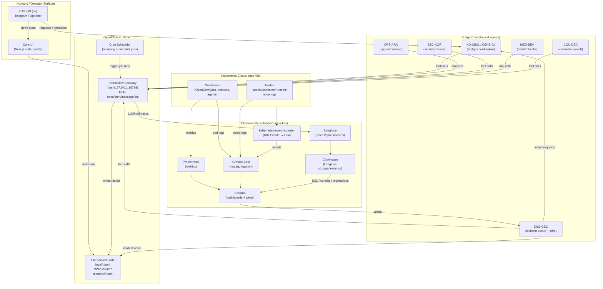

# uss-k8s — Bridge Crew + Observability / Analytics (Mermaid)

This diagram shows the split between:
- **State** (file-backed logs + vault notes) that UIs read
- **Actions** (OpenClaw tool calls / cron jobs) that change state
- **Observability** (Langfuse+ClickHouse, Loki, Prometheus/Grafana) feeding KPI + regression

