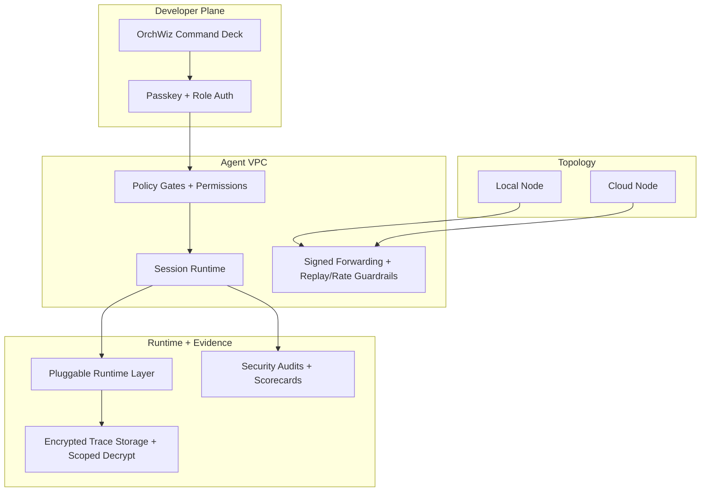

# OrchWiz

<div align="center">

**OrchWiz is the Agent VPC for AI infra engineers: a private, policy-controlled runtime network that runs agents across local + cloud nodes with full decision traceability.**

[](https://nextjs.org/)
[](https://www.typescriptlang.org/)
[](https://www.prisma.io/)
[](https://www.postgresql.org/)

</div>

## Why OrchWiz

- **Boundary**: Private-by-default runtime boundaries across local and cloud nodes with explicit forwarding controls.
- **Control**: Policy gates, permissions, and deployment/session controls for operator-grade Agent Ops.
- **Traceability**: Auditable prompts, tool calls, actions, and risk scoring for every run.

## Start Local in 15 Minutes

This is the shortest local path for a clean setup.

```bash
git clone git@github.com:QSchlegel/OrchWiz.git
cd OrchWiz
git submodule update --init --recursive infra/vendor/kubeview

cd dev-local
docker compose up -d

cd ../node
cp .env.example .env
npm install
npm run db:generate
npm run db:push
npm run db:seed
npm run dev
```

Open [http://localhost:3000](http://localhost:3000).

For the full setup (required env values, wallet-enclave modes, troubleshooting), use
[Getting Started](docs/GETTING_STARTED.md).

Ship clusters include bundled KubeView support (local + cloud profiles) for topology visualization.

## Agent VPC Boundary Diagram



## What Makes OrchWiz Different

| Need | OrchWiz approach | Typical approach |
| --- | --- | --- |
| Runtime boundary | Node-aware, private-by-default topology with explicit forwarding controls | Flat orchestration with unclear environment boundaries |
| Execution control | Policy presets + permission gates + machine/session auth paths | Script-level controls that drift over time |
| Audit path | Security audits, scorecards, encrypted traces, typed event streams | Logs and traces spread across disconnected tools |
| Deployment model | Local starship and cloud shipyard profiles in one control plane | Separate stacks for local and cloud workflows |
| Contributor fit | Runtime adapter and security-track contributions mapped to issue labels | Generic contribution guidance with unclear priorities |

## Contributor Tracks

Primary target: integration and runtime-adapter contributors.

- **Runtime adapters**: provider chains, runtime connectors, and execution reliability.
- **Security and governance**: policy coverage, audit checks, and ownership posture.
- **Topology operations**: forwarding, ship-yard workflows, and local/cloud provisioning paths.

Find issues with labels:

- [`good first issue`](https://github.com/QSchlegel/OrchWiz/issues?q=is%3Aopen+label%3A%22good+first+issue%22)
- [`help wanted`](https://github.com/QSchlegel/OrchWiz/issues?q=is%3Aopen+label%3A%22help+wanted%22)
- [`enhancement`](https://github.com/QSchlegel/OrchWiz/issues?q=is%3Aopen+label%3Aenhancement)

### Good First Contribution Targets (Adapter/Integration-Oriented)

- Add or improve runtime provider behavior in `node/src/lib/runtime/providers/`.
- Improve adapter dispatch safety checks in `node/src/lib/bridge/connections/`.
- Expand forwarding validation and guardrails in `node/src/lib/forwarding/`.
- Add tests around runtime fallback and policy behavior in `node/src/lib/runtime/` and `node/src/lib/execution/`.

## First Contribution Workflow

1. Pick one open issue from a contributor label.
2. Comment on the issue with your implementation plan.
3. Create a branch from `main`.
4. Implement and run quality gates locally.
5. Open a PR using the template in `.github/PULL_REQUEST_TEMPLATE.md`.

### Quality Gates

Run from `/node`:

```bash
npm run lint
npm run test
npm run build
```

## Compliance

OrchWiz tracks an ISO 27001 + SOC 2 (Security, Availability, Confidentiality)
cert-ready baseline in-repo to make control ownership, mappings, and evidence
collection explicit and repeatable.

This documentation does not claim completed certification or attestation.

- [Compliance overview](docs/compliance/README.md)
- [Control map](docs/compliance/control-map.md)
- [Evidence checklist](docs/compliance/evidence-checklist.md)
- [90-day roadmap](docs/compliance/roadmap-90-days.md)

## Documentation

- [Getting started](docs/GETTING_STARTED.md)
- [Current features](docs/CURRENT_FEATURES.md)
- [Compliance overview](docs/compliance/README.md)
- [Contribution guide](CONTRIBUTING.md)
- [Marketing execution plan](MARKETING_EXECUTION.md)
- [Node app README](node/README.md)
- [Ship Yard smoke harness](node/README.md#ship-yard-api-smoke-harness)
- [Infrastructure setup](infra/README.md)
- [Architecture overview](OWZ-Vault/01-Project-Overview/Architecture.md)
- [Node concept](OWZ-Vault/01-Project-Overview/Node-Concept.md)
- [Web clipper setup](OWZ-Vault/05-Resources/Web-Clipper-Setup.md)
- [API docs](OWZ-Vault/03-Technical/API-Documentation.md)
- [Database schema](OWZ-Vault/03-Technical/Database-Schema.md)
- [Deployment guide](OWZ-Vault/03-Technical/Deployment-Guide.md)

## Community Channels

- Issues: <https://github.com/QSchlegel/OrchWiz/issues>
- Discussions: <https://github.com/QSchlegel/OrchWiz/discussions>

## License

MIT
